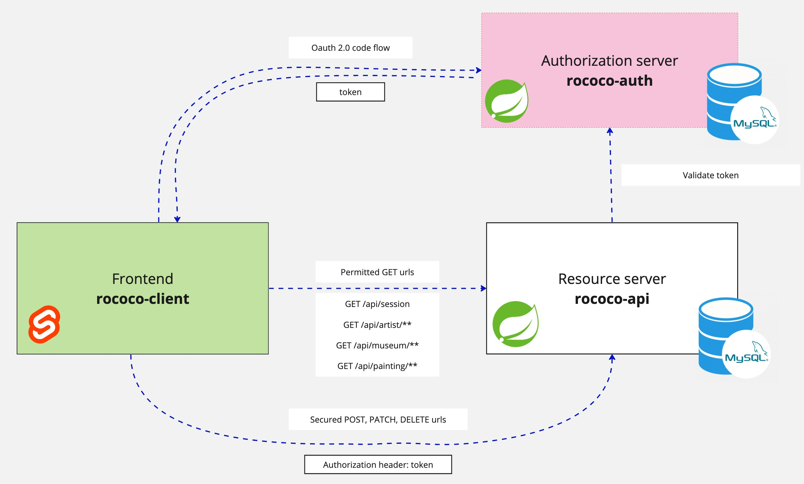
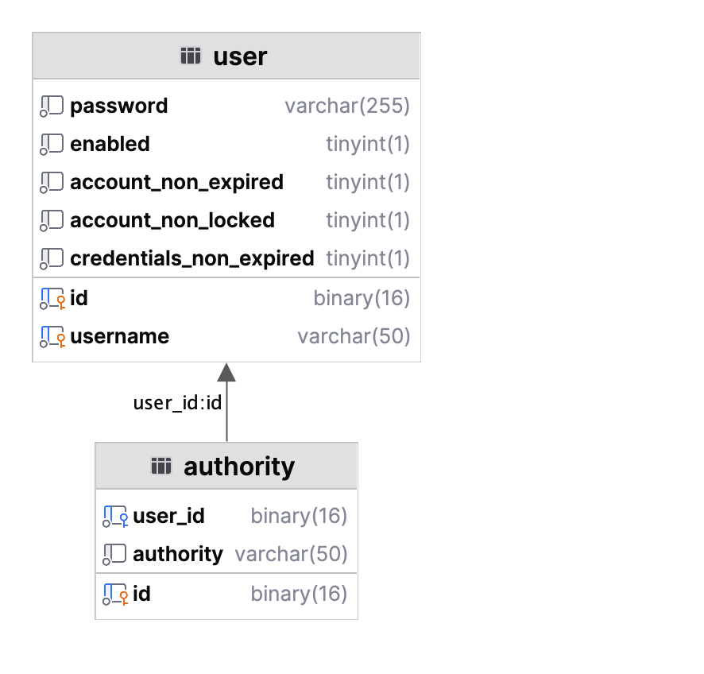
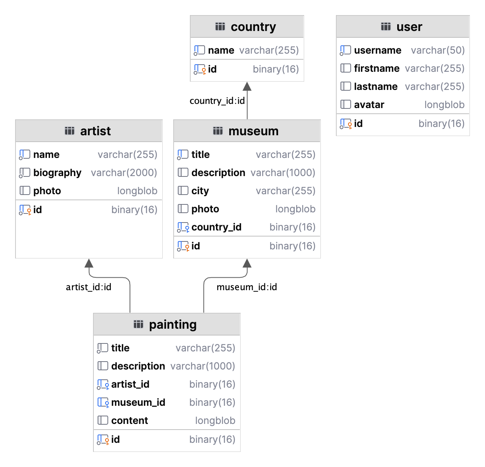
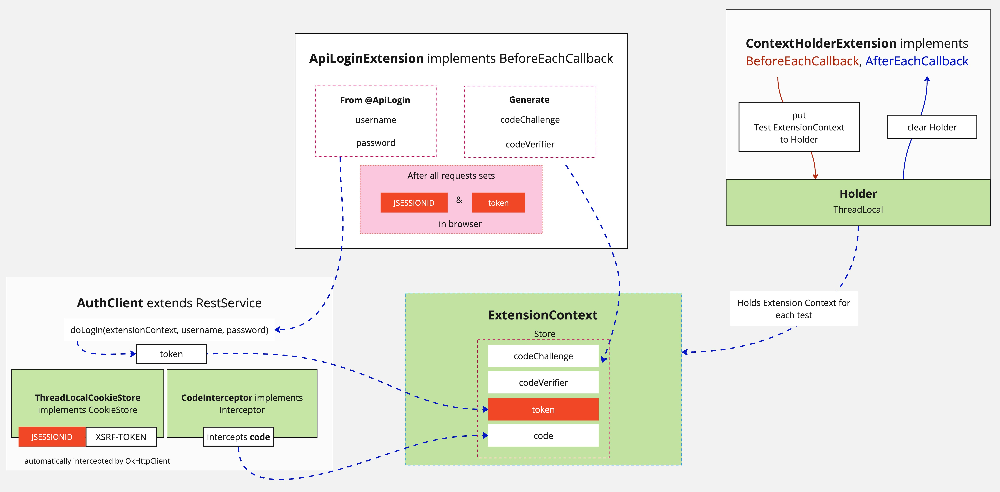

# Rococo

Rococo - демонстрационное приложение для Heisenbug 2023 Autumn, доклад [The art of JUnit extensions](https://heisenbug.ru/talks/0ff39adbc2ff4e19b54a4bb5d8d2d766/)

# Оглавление
- [Используемые технологии](#используемые_технологии)
- [Архитектура приложения](#архитектура_приложения)
- [Архитектура базы данных](#архитектура_бд)
- [Схема JUnit Extensions](#схема_junit)
- [Запуск приложения локально в IDE](#запуск_приложения_в_ide)
- [Запуск тестов локально](#запуск_тестов_локально)

<a name="используемые_технологии"></a>
# Используемые технологии

- [Spring Authorization Server](https://spring.io/projects/spring-authorization-server)
- [Spring OAuth 2.0 Resource Server](https://docs.spring.io/spring-security/reference/servlet/oauth2/resource-server/index.html)
- [Spring Data JPA](https://spring.io/projects/spring-data-jpa)
- [Spring Web](https://docs.spring.io/spring-framework/docs/current/reference/html/web.html#spring-web)
- [MySql](https://www.mysql.com/)
- [Svelte](https://svelte.dev/)
- [SkeletonUI](https://www.skeleton.dev/)
- [JUnit 5 (Extensions)](https://junit.org/junit5/docs/current/user-guide/)
- [Selenide](https://selenide.org/)
- [Java 17](https://www.oracle.com/java/technologies/javase/jdk17-archive-downloads.html)
- [Gradle 7.6](https://docs.gradle.org/7.6/release-notes.html)

<a name="архитектура_приложения"></a>
# Архитектура приложения

Приложение Rococo построено на основе сервисов, реализующих Oauth 2.0 code flow:
1. **rococo-auth** - аутентификация и авторизация (*authorization server*).
2. **rococo-api** - бэкенд (*resource server*).
6. **rococo-client** - интерфейс приложения, с которым взаимодействует пользователь (*frontend*).



<a name="архитектура_бд"></a>
# Архитектура базы данных
- сервис **rococo-auth**
  
- сервис **rococo-api**
  

<a name="схема_junit"></a>
# Схема JUnit Extensions
  

<a name="запуск_приложения_в_ide"></a>
# Запуск приложения локально в IDE

#### 1. Запустить БД и frontend командой
```posh
bash up-local.sh
```
#### 2. Запустить backend сервисы Rococo командой Run в IDE в следующем порядке

*rococo-auth -> rococo-api

<a name="запуск_тестов_локально"></a>
# Запуск тестов локально

#### 1. Запустить приложение rococo

#### 2. Запустить все тесты 
```posh
./gradlew :rococo-e2e:test
```
